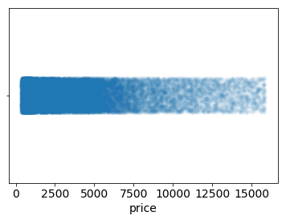
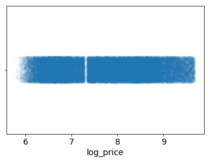
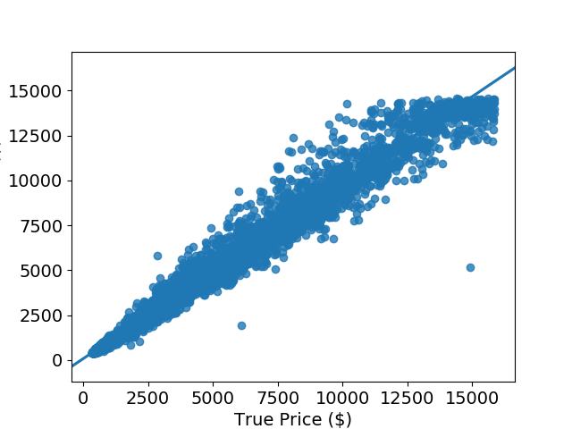
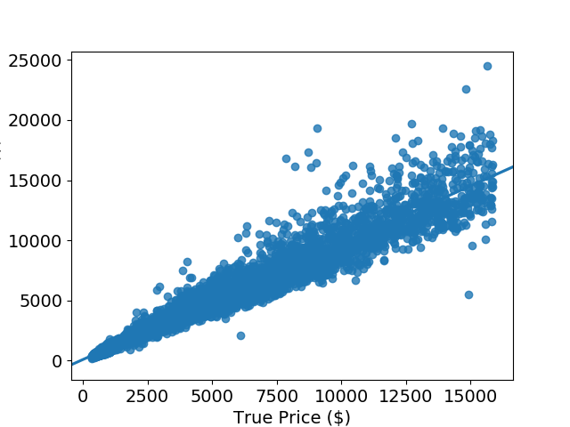

# Application of random forest regression and comparison to performance of multiple linear regression in modeling the prices of diamonds
## Carly Wolfbrandt

### Table of Contents
1. [Objective](#objective)
2. [Exploratory Data Analysis](#eda)
    1. [Diamond Dataset](#dataset) 
    2. [Data Cleaning](#cleaning)
    3. [Feature Engineering](#engineering)
3. [Modelling](#model)
    1. [Model Pipeline](#pipeline)
    2. [Model Scoring](#scoring)
    3. [Random Forest](#rf)
    4. [Linear Regression](#lm)

## Objective 

Build a model that will predict price for each record, given an input file with the same layout as diamonds.txt, minus price.

## Exploratory Data Analysis 

### Diamond Dataset 

The diamond dataset contains prices and other attributes of almost 40,000 diamonds. The raw data has 9 features - 3 ordinal categorical (cut, color and clarity) and 6 numerical (price, depth, table, x, y and z).

The features are described as follows: 

***ORDINAL CATEGORICAL***

**Cut**: quality of the cut (Fair, Good, Very Good, Premium, Ideal)

**Color**: diamond color, from J (worst) to D (best)

**Clarity**: a measurement of how clear the diamond is (I1 (worst), SI2, SI1, VS2, VS1, VVS2, VVS1, IF (best))

***NUMERICAL***

**Price**: in US dollars

**Depth**: total depth percentage = z / mean(x, y) = 2 * z / (x + y)

**Table**: width of top of diamond relative to widest point

**X**: length in mm 

**Y**: width in mm

**Z**: depth in mm 

**Table 1**: Initial diamond dataset 

|    |   price | cut     | color   | clarity   |   depth |   table |    x |    y |    z |
|---:|--------:|:--------|:--------|:----------|--------:|--------:|-----:|-----:|-----:|
|  0 |     326 | Ideal   | E       | SI2       |    61.5 |      55 | 3.95 | 3.98 | 2.43 |
|  1 |     326 | Premium | E       | SI1       |    59.8 |      61 | 3.89 | 3.84 | 2.31 |
|  2 |     327 | Good    | E       | VS1       |    56.9 |      65 | 4.05 | 4.07 | 2.31 |
|  3 |     334 | Premium | I       | VS2       |    62.4 |      58 | 4.2  | 4.23 | 2.63 |
|  4 |     335 | Good    | J       | SI2       |    63.3 |      58 | 4.34 | 4.35 | 2.75 |

### Data Cleaning 

The dataset needed to be cleaned prior to model building. Looking at the descriptive statistics, it is apparent that there are rows where at least one dimension of the diamond is 0, which is impossible if we are to believe the diamond is a 3 dimensional object. The minimum values for the x, y and z dimensions are 0, as shown in Table 2.

**Table 2**: Descriptive statistics of dataset summarizing the central tendency, dispersion and shape of distribution

|       |    price |      depth |       table |           x |           y |            z |
|:------|---------:|-----------:|------------:|------------:|------------:|-------------:|
| count | 40000    | 40000      | 40000       | 40000       | 40000       | 40000        |
| mean  |  3927.02 |    61.7537 |    57.4608  |     5.72918 |     5.73174 |     3.53813  |
| std   |  3982.23 |     1.43   |     2.23462 |     1.12113 |     1.12016 |     0.709047 |
| min   |   326    |    43      |    43       |     0       |     0       |     0        |
| 25%   |   949    |    61      |    56       |     4.71    |     4.72    |     2.91     |
| 50%   |  2401    |    61.8    |    57       |     5.7     |     5.71    |     3.52     |
| 75%   |  5313.25 |    62.5    |    59       |     6.54    |     6.54    |     4.0325   |
| max   | 18823    |    79      |    95       |    10.14    |    31.8     |    31.8      |

Since there were 40,000 data points, there was enough data that these bad rows could be dropped. The rows where any value was +/- 3 standard deviations from the mean were dropped from the dataset. This method is preffered, as it is productionizable - i.e., the cleaning function can be applied to any new dataframe and offers reproducible results. This left 38,371 rows, as shown in Table 3. 

**Table 3**: Descriptive statistics summarizing the central tendency, dispersion and shape of distribution for cleaned dataset

|       |    price |       depth |       table |           x |           y |            z |
|:------|---------:|------------:|------------:|------------:|------------:|-------------:|
| count | 38371    | 38371       | 38371       | 38371       | 38371       | 38371        |
| mean  |  3615.54 |    61.757   |    57.3739  |     5.6665  |     5.66966 |     3.50025  |
| std   |  3473.15 |     1.26721 |     2.09609 |     1.06854 |     1.06103 |     0.660391 |
| min   |   326    |    57.5     |    51       |     3.73    |     3.71    |     1.53     |
| 25%   |   928    |    61.1     |    56       |     4.69    |     4.7     |     2.89     |
| 50%   |  2316    |    61.8     |    57       |     5.66    |     5.67    |     3.5      |
| 75%   |  5080    |    62.5     |    59       |     6.49    |     6.49    |     4.02     |
| max   | 15873    |    66       |    64       |     9.08    |     9.01    |     5.65     |

### Feature Engineering 

Now that the dataset has been cleaned of outliers, some features will need to be engineered to prepare for model building. The ordinal categorical attributes were defined as having order amongst the values. Based on this order, a mapping scheme was  generated where each cut, color and clarity value was mapped to a number in accordance to its hierarchy. In this scheme, a higher number indicates a "better" value.

**Table 4**: Replacing categorical values with ordinal values

|    |   price |   cut |   color |   clarity | depth |   table |    x |    y |    z |
|---:|--------:|------:|--------:|----------:|--------:|--------:|-----:|-----:|-----:|
|  0 |     326 |     5 |       6 |         2 |    61.5 |      55 | 3.95 | 3.98 | 2.43 |
|  1 |     326 |     4 |       6 |         3 |    59.8 |      61 | 3.89 | 3.84 | 2.31 |
|  2 |     327 |     2 |       6 |         5 |    56.9 |      65 | 4.05 | 4.07 | 2.31 |
|  3 |     334 |     4 |       2 |         4 |    62.4 |      58 | 4.2  | 4.23 | 2.63 |
|  4 |     335 |     2 |       1 |         2 |    63.3 |      58 | 4.34 | 4.35 | 2.75 |

From the descriptions of each feature, it is obvoius that depth is colinear with the dimensions, as depth is a function of x, y and z. In order to avoid multicollinearity, or when one predictor variable in a multiple regression model can be linearly predicted from the others with a high degree of accuracy, this feature can be dropped from the dataset.

Another solution is to use decision trees or boosted trees algorithms, as they are immune to multicollinearity, since the tree will choose only one of the perfectly correlated features upon splitting. I chose to implement both models and tested their accuracy. 

Futhermore, the dimensions can be engineered into a volume by multiplying them to create a new feature. This greatly simplifies the model, by reducing 3 features into 1.

**Table 5**: Dataframe with x, y and z reduced to volume

|    |   price |   cut |   color |   clarity |   table |   volume |
|---:|--------:|------:|--------:|----------:|--------:|---------:|
|  0 |     326 |     5 |       6 |         2 |      55 |  38.202  |
|  1 |     326 |     4 |       6 |         3 |      61 |  34.5059 |
|  3 |     334 |     4 |       2 |         4 |      58 |  46.7246 |
|  4 |     335 |     2 |       1 |         2 |      58 |  51.9172 |
|  5 |     336 |     3 |       1 |         6 |      57 |  38.694  |

Finally, the distribution of the prices in our dataset is heavily skewed towards 0. Figure 1 shows a strip plot of the distribution of the prices, where the shading corresponds to the density of the data.

**Figure 1**: Strip plot of the raw price datapoints

Distributions such as this often indicate that a variable needs to be transformed. If we were to fit a model to predict these responses, we would expect our residuals (the difference between what we observe and what we predict) to be similarly skewed. Figure 2 shows studentized residuals for a model fit to the price.

**Figure 2**: Studentized residuals of the predicted price from a linear regression model

Skewed data can be easily fixed by taking a logarithm of the feature. This allows for a more even distribution of the price data, and can be easily reversed when interpreting the model by exponentiating the responses after predicting. Figure 3 shows the distribution from Figure 1, transformed by taking a logarithm.

**Figure 3**: Strip plot of the logarithm of the price datapoints

We should now expect our residuals to be much more evenly centered around 0 in our studentized residual plot.

**Figure 4**: Studentized residuals of the predicted price from a linear regression model

The same procedure was applied to the volume to evenly distribute the datapoints. The final dataframe used for modeling can be seen in Table 6.

**Table 6**: Final dataframe for model building

|    |   log_price |   color |   cut |   clarity |   log_volume |   table |
|---:|------------:|--------:|------:|----------:|-------------:|--------:|
|  0 |     5.7869  |       6 |     5 |         2 |      3.64289 |      55 |
|  1 |     5.7869  |       6 |     4 |         3 |      3.54113 |      61 |
|  3 |     5.81114 |       2 |     4 |         4 |      3.84427 |      58 |
|  4 |     5.81413 |       1 |     2 |         2 |      3.94965 |      58 |
|  5 |     5.81711 |       1 |     3 |         6 |      3.65568 |      57 |

## Modelling 

### Model Pipeline 

The above preprocessing and feature engineering was integrated into a scikit-learn pipeline; a pipeline sequentially applies a list of transforms and a final estimator, where intermediate steps of pipeline must implement fit and transform methods and the final estimator only needs to implement fit. The code for the diamond model can be found [here](https://github.com/cwolfbrandt/diamond_dataset/blob/master/src/diamond_model.py). 

The script takes arguments 'data' : a tab delimited csv file with input data, either for model building or predictions, 'model_output_path' : where to save the serialized model object file, 'model_input_path' : serialized model object to use for predictions, 'output_file' : where to save the model predictions file, 'mode' : either train a new model or predict using an existing model, 'tree_model' : if True, use random forest model, if not specified, use linear regression model.

The above script can both train and predict price responses, based on the arguments provided. If training, either random forest regression or linear regression can be used to generate a serialized model output. If predicting, an input of either a serialized random forest or linear regression model is needed to generate a text file of the price responses. 

When training, a PNG file of the predicted responses vs. the true responses is generated, as well as statistical metrics for model scoring.

### Model Scoring 

Mean absolute error (MAE), root mean squared error (RMSE), and R-squared (R2) are three of the most common metrics used to measure accuracy for continuous variables. MAE and RMSE, are particularly useful and, depending on the model, the differences can be subtle or obvious.

Both MAE and RMSE measure the average magnitude of the errors in a set of predictions. MAE is the average of the absolute differences between predictions and true responses (where all individual differences have equal weight), while RMSE is the square root of the average of the squared differences between predictions and true repsonses. Both metrics range from 0 to ∞ and don't account for the direction of errors. MAE and RMSE are both negatively-oriented, meaning smaller values are better.

However, since errors are squared before they are averaged, the RMSE gives a relatively high weight to large errors. This means the RMSE penalizes large errors, and depending on the problem, is more informative. However, since RMSE does not describe average error alone, MAE is usually more useful.

R2 is related to RMSE, in that it is calculated by dividing the MSE (average of the squares of the residuals) by the variance in Y values. R2 represents the proportion of the variance for a dependent variable that is explained by independent variable(s) in a regression model. R2 is positively-oriented, meaning smaller values are worse.

### Random Forest 
 
Three scoring metrics for the random forest model are given below, along with the predicted responses vs. the true responses for the training and test data, as well as the importance of each feature in the model: 
 
        mean absolute error =  277.11
        root mean squared error =  509.31
        R squared =  0.98

The mean price from this dataset was $3,615.93. The MAE is $277.11 while the RMSE is $509.31. Looking at Figure 5, it is obvious why the RMSE is higher than the MAE - as the predicted prices get higher, the errors get larger. Since RMSE penalizes for large errors, we expect it to be greater than the MAE for this model.

While the errors are large, the overall fit of the model is very good. The highest score for R2 is 1.0, so an R2 of 0.98 is excellent. However, the magnitude of the MAE and RMSE mean that, although the fit is excellent, the model is subpar.

**Figure 5**: Predicted price vs. true price for random forest regression model

Table 7 shows the feature importance for each feature in the model. Since random forest consists of a number of decision trees, where every node is a single feature designed to split the dataset so that similar response values are distributed evenly across sets. Thus when training a regression tree, each feature addition should have an effect on the variance. For a forest, the variance decrease from each feature can be averaged and the features are ranked according to how much they decrease the variance. 

**Table 7**: Feature importance for random forest regression model

|            |   feature_importance |
|:-----------|---------------------:|
| log_volume |          0.951494    |
| clarity    |          0.0322812   |
| color      |          0.0147471   |
| cut        |          0.00106129  |
| table      |          0.000416271 |

As shown in Table 7, the logarithm of the volume had the highest effect on the variance in training. It would seem that this is the most important feature, however, feature importance is not that simple. Correlations in data can lead to incorrect conclusions that one of the variables is a strong predictor while others are unimportant. There are ways to tease this out, but they are outside of the scope of this project.

### Linear Regression 

Three scoring metrics for the linear regression model are given below, along with the predicted responses vs. the true responses for the training and test data, as well as the importance of each feature in the model: 

        mean absolute error =  417.66
        root mean squared error =  779.50
        R squared =  0.95
 
The mean price from this dataset was $3,615.93. The MAE is $417.66 while the RMSE is $779.50. This model suffers from the same problems as the random forest model, since as the predicted prices get higher, the errors get larger. Recalling that RMSE penalizes for large errors, we expect it to be greater than the MAE for this model. Comparing Figure 5 to Figure 6, we also expect the RMSE and MAE to be higher for the linear regression model than for the random forest model.

While the errors are large, the overall fit of 0.95 is very good but not as good as the random forest model at 0.98. However, the magnitude of the MAE and RMSE mean that, although the fit good, the model is even more subpar than the random forest model.
 

**Figure 6**: Predicted price vs. true price for linear regression model

Table 8 shows the coefficients for each feature. The magnitude of these coefficients cannot be interpreted in the same way that the feature importances for the random forest model. Unless the data is standardized before training, the magnitude of the coefficients is meaningless.

**Table 8**: Coefficients for linear regression model

|            |     value |
|:-----------|----------:|
| log_volume | 1.88635   |
| clarity    | 0.119566  |
| color      | 0.0766382 |
| cut        | 0.0195203 |
| table      | 0.0039767 |

Comparing the above metrics to the random forest model, it is apparent that the fit of the random forest model is superior. However, the complexity of a random forest model mean they are more computationally expensive than a linear regression model. Therefore, it is not always a better choice.
