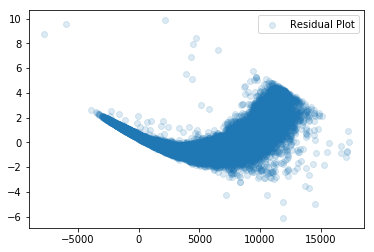
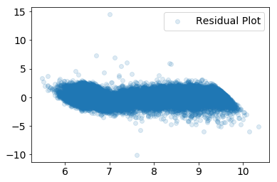

# diamond_dataset
# Building a linear regression and random forest model to predict prices of diamonds
## Carly Wolfbrandt

### Table of Contents
1. [Exploratory Data Analysis](#eda)
    1. [Diamond Dataset](#dataset) 
    2. [Data Cleaning](#cleaning)
    3. [Feature Engineering](#engineering)
4. [Model Outputs](#model)
    1. [Linear Regression](#lm)
    2. [Random Forest](#rf)
5. [Future Work](#future_work)

## Exploratory Data Analysis 

### Diamond Dataset 

The diamond dataset contains prices and other attributes of almost 40,000 diamonds. The raw data has 9 features - 3 ordinal categorical (cut, color and clarity) and 6 numerical (price, depth, table, x, y and z).

The features are described as follows: 

***ORDINAL CATEGORICAL***

**Cut**: quality of the cut (Fair, Good, Very Good, Premium, Ideal)

**Color**: diamond color, from J (worst) to D (best)

**Clarity**: a measurement of how clear the diamond is (I1 (worst), SI2, SI1, VS2, VS1, VVS2, VVS1, IF (best))

***NUMERICAL***

**Price**: in US dollars

**Depth**: total depth percentage = z / mean(x, y) = 2 * z / (x + y)

**Table**: width of top of diamond relative to widest point

**X**: length in mm 

**Y**: width in mm

**Z**: depth in mm 

**Table 1**: Initial diamond dataset 

|    |   price | cut     | color   | clarity   |   depth |   table |    x |    y |    z |
|---:|--------:|:--------|:--------|:----------|--------:|--------:|-----:|-----:|-----:|
|  0 |     326 | Ideal   | E       | SI2       |    61.5 |      55 | 3.95 | 3.98 | 2.43 |
|  1 |     326 | Premium | E       | SI1       |    59.8 |      61 | 3.89 | 3.84 | 2.31 |
|  2 |     327 | Good    | E       | VS1       |    56.9 |      65 | 4.05 | 4.07 | 2.31 |
|  3 |     334 | Premium | I       | VS2       |    62.4 |      58 | 4.2  | 4.23 | 2.63 |
|  4 |     335 | Good    | J       | SI2       |    63.3 |      58 | 4.34 | 4.35 | 2.75 |

### Data Cleaning 

The dataset needed to be cleaned prior to model building. Looking at the descriptive statistics, it is apparent that there are rows where at least one dimension of the diamond is 0, which is impossible if we are to believe the diamond is a 3 dimensional object. The minimum values for the x, y and z dimensions are 0, as shown in Table 2.

**Table 2**: Descriptive statistics of dataset summarizing the central tendency, dispersion and shape of distribution

|       |    price |      depth |       table |           x |           y |            z |
|:------|---------:|-----------:|------------:|------------:|------------:|-------------:|
| count | 40000    | 40000      | 40000       | 40000       | 40000       | 40000        |
| mean  |  3927.02 |    61.7537 |    57.4608  |     5.72918 |     5.73174 |     3.53813  |
| std   |  3982.23 |     1.43   |     2.23462 |     1.12113 |     1.12016 |     0.709047 |
| min   |   326    |    43      |    43       |     0       |     0       |     0        |
| 25%   |   949    |    61      |    56       |     4.71    |     4.72    |     2.91     |
| 50%   |  2401    |    61.8    |    57       |     5.7     |     5.71    |     3.52     |
| 75%   |  5313.25 |    62.5    |    59       |     6.54    |     6.54    |     4.0325   |
| max   | 18823    |    79      |    95       |    10.14    |    31.8     |    31.8      |

Since there were 40,000 data points, there was enough data that these bad rows could be dropped. The rows where any value was +/- 3 standard deviations from the mean were dropped from the dataset. This method is preffered, as it is productionizable - i.e., the cleaning function can be applied to any new dataframe and offers reproducible results. This left 38,371 rows, as shown in Table 3. 

**Table 3**: Descriptive statistics summarizing the central tendency, dispersion and shape of distribution for cleaned dataset

|       |    price |       depth |       table |           x |           y |            z |
|:------|---------:|------------:|------------:|------------:|------------:|-------------:|
| count | 38371    | 38371       | 38371       | 38371       | 38371       | 38371        |
| mean  |  3615.54 |    61.757   |    57.3739  |     5.6665  |     5.66966 |     3.50025  |
| std   |  3473.15 |     1.26721 |     2.09609 |     1.06854 |     1.06103 |     0.660391 |
| min   |   326    |    57.5     |    51       |     3.73    |     3.71    |     1.53     |
| 25%   |   928    |    61.1     |    56       |     4.69    |     4.7     |     2.89     |
| 50%   |  2316    |    61.8     |    57       |     5.66    |     5.67    |     3.5      |
| 75%   |  5080    |    62.5     |    59       |     6.49    |     6.49    |     4.02     |
| max   | 15873    |    66       |    64       |     9.08    |     9.01    |     5.65     |

### Feature Engineering 

Now that the dataset has been cleaned of outliers, some features will need to be engineered to prepare for model building. The ordinal categorical attributes were defined as having order amongst the values. Based on this order, a mapping scheme was  generated where each cut, color and clarity value was mapped to a number in accordance to its hierarchy. In this scheme, a higher number indicates a "better" value.

**Table 4**: Replacing categorical values with ordinal values

|    |   price |   cut |   color |   clarity | depth |   table |    x |    y |    z |
|---:|--------:|------:|--------:|----------:|--------:|--------:|-----:|-----:|-----:|
|  0 |     326 |     5 |       6 |         2 |    61.5 |      55 | 3.95 | 3.98 | 2.43 |
|  1 |     326 |     4 |       6 |         3 |    59.8 |      61 | 3.89 | 3.84 | 2.31 |
|  2 |     327 |     2 |       6 |         5 |    56.9 |      65 | 4.05 | 4.07 | 2.31 |
|  3 |     334 |     4 |       2 |         4 |    62.4 |      58 | 4.2  | 4.23 | 2.63 |
|  4 |     335 |     2 |       1 |         2 |    63.3 |      58 | 4.34 | 4.35 | 2.75 |

From the descriptions of each feature, it is obvoius that depth is colinear with the dimensions, as depth is a function of x, y and z. In order to avoid multicollinearity, or when one predictor variable in a multiple regression model can be linearly predicted from the others with a high degree of accuracy, this feature can be dropped from the dataset.

Another solution is to use decision trees or boosted trees algorithms, as they are immune to multicollinearity, since the tree will choose only one of the perfectly correlated features upon splitting. I chose to implement both models and tested their accuracy. 

Futhermore, the dimensions can be engineered into a volume by multiplying them to create a new feature. This greatly simplifies the model, by reducing 3 features into 1.

**Table 5**: Dataframe with x, y and z reduced to volume

|    |   price |   cut |   color |   clarity |   table |   volume |
|---:|--------:|------:|--------:|----------:|--------:|---------:|
|  0 |     326 |     5 |       6 |         2 |      55 |  38.202  |
|  1 |     326 |     4 |       6 |         3 |      61 |  34.5059 |
|  3 |     334 |     4 |       2 |         4 |      58 |  46.7246 |
|  4 |     335 |     2 |       1 |         2 |      58 |  51.9172 |
|  5 |     336 |     3 |       1 |         6 |      57 |  38.694  |

 
 

**Table 6**: Final dataframe for model building

|    |   log_price |   color |   cut |   clarity |   log_volume |   table |
|---:|------------:|--------:|------:|----------:|-------------:|--------:|
|  0 |     5.7869  |       6 |     5 |         2 |      3.64289 |      55 |
|  1 |     5.7869  |       6 |     4 |         3 |      3.54113 |      61 |
|  3 |     5.81114 |       2 |     4 |         4 |      3.84427 |      58 |
|  4 |     5.81413 |       1 |     2 |         2 |      3.94965 |      58 |
|  5 |     5.81711 |       1 |     3 |         6 |      3.65568 |      57 |

## Model Building 

### Linear Regression 

        explained variance score =  0.98
        mean absolute error =  277.11
        root mean squared error =  509.31
        R squared =  0.98

        explained variance score =  0.95
        mean absolute error =  417.66
        root mean squared error =  779.50
        R squared =  0.95
    

### Random Forest 

## Future Work 

